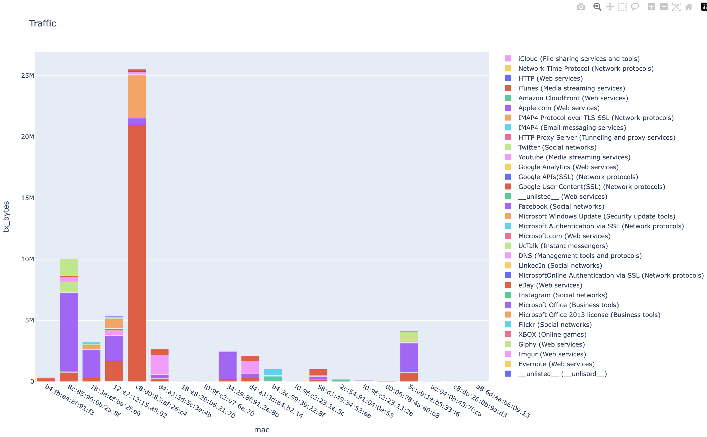

# Unifi Controller Client for Python

---

A Python client to the RESTful API of Unifi controller. Access traffic statistics about the managed network, list client hosts on the network, 
~~get alarm system alarm~~ and ~~adopt new devices~~.

Example of getting 5min traffic data by access point:
```
import sys 
import json

import unifi_client
import unifi_client_utils

# This will log in with the credentials. A UnifiAPIClientException is thrown if authentication fails or some other problem like a bad hostname

# The verify=False parameter is because by default the controller uses a self signed certificate.

# The verify parameter can also be a path to the PEM file of the controller cert. The default cert is expired so setting file doesn't do much good but would be fine if you are using your own self signed cert
unifi_client = unifi_client.UnifiAPIClient("https://1.2.2.1:8443", 
                                           "username", "password", 
                                           verify=False)
                                          

# the 'default' site should always be there but better safe than sorry

if "default" not in map(lambda s: s["name"], unifi_client.get_sites()["data"]):
    print("no default site! Bail")
    sys.exit(-1)

site = "default"

site_traffic_stats =  unifi_client.get_5min_ap_all_stats(site, *unifi_client_utils.one_hour_ago())

print(json.dumps(site_traffic_stats, indent=4))
```

Output of from methods are JSON which can be fed into other tools

Partial code example of graphing with plotly. Full code in example folder
```

traffic_stats = unifi_client.get_dpi_by_app("default")

pd = {'mac':[], 'tx_bytes':[], 'category': []}
for device in traffic_stats["data"]:
    mac = device["mac"]
    for app in device["by_app"]:
        pd['mac'].append(mac)
        pd['tx_bytes'].append(app['tx_bytes'])
        pd['category'].append(f"{app['x_app']} ({app['x_cat']})")


traffic_data_frame= pandas.DataFrame(data=pd)

fig = px.bar(traffic_data_frame, x="mac", y="tx_bytes", color="category", title="Traffic")
fig.show()

```


## Controller Support

The client only supports direct access to Cloud Keys. The Unifi web portal is not supported.

The client has only been tested with a Cloud Key 1 running software version  7.2.97.

## API Endpoints methods and helpers

Ubiquiti has not provided official documentation on the API to their controllers. Most of the endpoints information is from Ubiquiti users. The implementation in the Python client may change in the future.


| name                                                         | python client method          | method parameters                                                                                                                               | controller endpoint                         | notes                                                 |
|--------------------------------------------------------------|-------------------------------|-------------------------------------------------------------------------------------------------------------------------------------------------|---------------------------------------------|-------------------------------------------------------|
| Get self                                                     | get_self                      | (none)                                                                                                                                          | /api/self                                   |                                                       |
| Get sites                                                    | get_sites                     | (none)                                                                                                                                          | /api/self/sites                             |                                                       |
| Get controller stats                                         | get_self_site_stats           | (none)                                                                                                                                          | /api/stat/sites                             |                                                       |
| Get devices for site                                         | get_devices_for_site          | site                                                                                                                                            | /api/s/{site}/stat/device                   |                                                       |
| Get stats for 'default' site                                 | get_devices_for_default_site  | (none)                                                                                                                                          | /api/s/default/stat/device                  |                                                       |
| Get traffic stats by interval for a device type for site     | get_stats_for_site            | site, interval, element_type,stat_attributes, (optional) start_epoch_timestamp_ms, (optional) end_epoch_timestamp_ms,(optional) filter_mac_list | /api/s/{site}/stat/report/{interval}.{what} | if timestamps are not provided the default is 12hours |
| Get site traffic stats in 5min interval bin                  | get_5min_site_all_stats       | site, (optional) start_epoch_timestamp_ms, (optional) end_epoch_timestamp_ms                                                                    | /api/s/{site}/stat/report/5minutes.site     | convenience helper for get_stats_for_site                               |
| Get ap traffic stats in 5min interval bin                    | get_5min_ap_all_stats         | site, (optional) start_epoch_timestamp_ms, (optional) end_epoch_timestamp_ms                                                                    | /api/s/{site}/stat/report/5minutes.ap       | convenience helper for get_stats_for_site                                                      |
| Get user traffic stats in 5min interval bin                  | get_5min_user_all_stats       | site, (optional) start_epoch_timestamp_ms, (optional) end_epoch_timestamp_ms                                                                    | /api/s/{site}/stat/report/5minutes.user     | convenience helper for get_stats_for_site                                                      |
| Get site traffic stats in hourly interval bin                | get_hourly_site_all_stats     | site, (optional) start_epoch_timestamp_ms, (optional) end_epoch_timestamp_ms                                                                    | /api/s/{site}/stat/report/hourly.site       | convenience helper for get_stats_for_site                                                      |
| Get ap traffic stats in hourly interval bin                  | get_hourly_ap_all_stats       | site, (optional) start_epoch_timestamp_ms, (optional) end_epoch_timestamp_ms                                                                    | /api/s/{site}/stat/report/hourly.ap         | convenience helper for get_stats_for_site                                                      |
| Get user traffic stats in hourly interval bin                | get_hourly_user_all_stats     | site, (optional) start_epoch_timestamp_ms, (optional) end_epoch_timestamp_ms                                                                    | /api/s/{site}/stat/report/hourly.user       | convenience helper for get_stats_for_site                                                      |
| Get site traffic stats in day interval bin                   | get_daily_site_all_stats      | site, (optional) start_epoch_timestamp_ms, (optional) end_epoch_timestamp_ms                                                                    | /api/s/{site}/stat/report/daily.site        | convenience helper for get_stats_for_site                                                      |
| Get ap traffic stats in day interval bin                     | get_daily_ap_all_stats        | site, (optional) start_epoch_timestamp_ms, (optional) end_epoch_timestamp_ms                                                                    | /api/s/{site}/stat/report/daily.site        | convenience helper for get_stats_for_site                                                      |
| Get user traffic stats in day interval bin                   | get_daily_user_all_stats      | site, (optional) start_epoch_timestamp_ms, (optional) end_epoch_timestamp_ms                                                                    | /api/s/{site}/stat/report/daily.site        | convenience helper for get_stats_for_site                                                      |
| Get active client hosts for a site                           | get_active_clients_for_site   | site                                                                                                                                            | /api/s/{site}/stat/sta                      |                                                       |
| Get known client hosts for a site                            | get_known_clients_for_site    | site                                                                                                                                            | /api/s/{site}/rest/sta                      |                                                       |
| Get dynamic DNS information                                  | get_ddns_information_for_site | site                                                                                                                                            | /api/s/{site}/stat/dynamicdns               |                                                       |
| Get traffic by catagroy and application for a site           | get_site_dpi_by_app           | site, (optional) filter_category_list                                                                                                           | /api/s/{site}/stat/sitedpi                  |                                                       |
| Get traffic by catagroy for a site                           | get_site_dpi_by_category      | site                                                                                                                                            | /api/s/{site}/stat/sitedpi                  |                                                       |
| Get traffic by catagroy and application for a site by client | get_dpi_by_app                | site, (optional) filter_mac_list, (optional)filter_category_list                                                                                | /api/s/{site}/stat/statdpi                  |                                                       |
| Get traffic by catagroy for a site by client                 | get_dpi_by_category           | site, (optional) filter_mac_list                                                                                                                | /api/s/{site}/stat/statdpi                  |                                                       |
| Run a speed test                                             | run_speed_test                | site                                                                                                                                            | /api/s/{site}/cmd/devmgr                    |                                                       |
| Get speed test results                                       | status_speed_test             | site                                                                                                                                            | /api/s/{site}/cmd/devmgr                    |                                                       |

### Method Parameters 

| parameter name           | type             | description                                                                                                                                                                                 |
|--------------------------|------------------|---------------------------------------------------------------------------------------------------------------------------------------------------------------------------------------------|
| site                     | string           | name of site. must be known by controller. known sites names can be gotten from get_sites()                                                                                                 |
| interval                 | string           | binning period. must be one of '5minutes', 'hourly', 'daily'                                                                                                                                |
| element_type             | string           | binning by type. must be one of 'site', 'user', 'ap'                                                                                                                                        |
| stat_attributes          | array of strings | traffic attributes to return in results. Must be among list 'bytes', 'wan-tx_bytes', 'wan-rx_bytes', 'wlan_bytes', 'num_sta', 'lan-num_sta', 'wlan-num_sta', 'time', 'rx_bytes', 'tx_bytes' |
| start_epoch_timestamp_ms | int              | Unix UTC timestamp in milliseconds. Epoch * 1000                                                                                                                                            |
| end_epoch_timestamp_ms   | int              | Unix UTC timestamp in milliseconds. Epoch * 1000                                                                                                                                            |
| filter_category_list     | array of int     | List of integer IDs to limit traffic results by                                                                                                                                             |
| filter_mac_list          | array of strings | List of MAC addresses to limit results by                                                                                                                                                   |


## Error handing

Right now any errors will raise a UnifiAPIClientException. The error will have a text description of the cause.

## Application and traffic category

The client will attempt to extract the controller application and category id to human readable values. 

The results from traffic stats endpoint on the controller API will include an 'app' and 'cat' key each with a numeric id

```
{
  "app": 94,
  "cat": 19,
  "rx_bytes": 376721275,
  "rx_packets": 251829,
  "tx_bytes": 6427927,
  "tx_packets": 92375,
},
```

To make this more useful the Python client will attempt to map the values to something more meaningful.

```
{
  "app": 94,
  "cat": 19,
  "rx_bytes": 376721275,
  "rx_packets": 251829,
  "tx_bytes": 6427927,
  "tx_packets": 92375,
  "x_cat": "Network protocols",
  "x_app": "HTTP Protocol over TLS SSL",
  "x_cat_app_id": "efb4bec661f7d404283ba382b0d68112ad10d226422e33bdb30937f11edcc8cd:081554a0ecbfba1eaf6880e86e02b0b72558272394eda181add97f7374375686"
},
```

If the mapping isn't possible, the `x_` keys will be omitted from the results of the Python client call.

The `x_cat_app_id` value is an attempt to identify which version of the Unifi internal app and cat id mapping is being
used. The value is the sha256 hash of the dictionaries extracted from the controller for the cat and app mapping, joined with
a colon. This is intended to be used if in the future Unifi changes the mapping. All Ubiquiti internal id to text conversions 
with the same `x_cat_app_id` value can assumed to have been derived from the same version of the Unifi mapping.

__Extracting the mapping to name is a hack.__ If the client can't extract the mapping, it will skip translating 
Ubiquiti's internal id to text. More info in the extraction at this gist.


